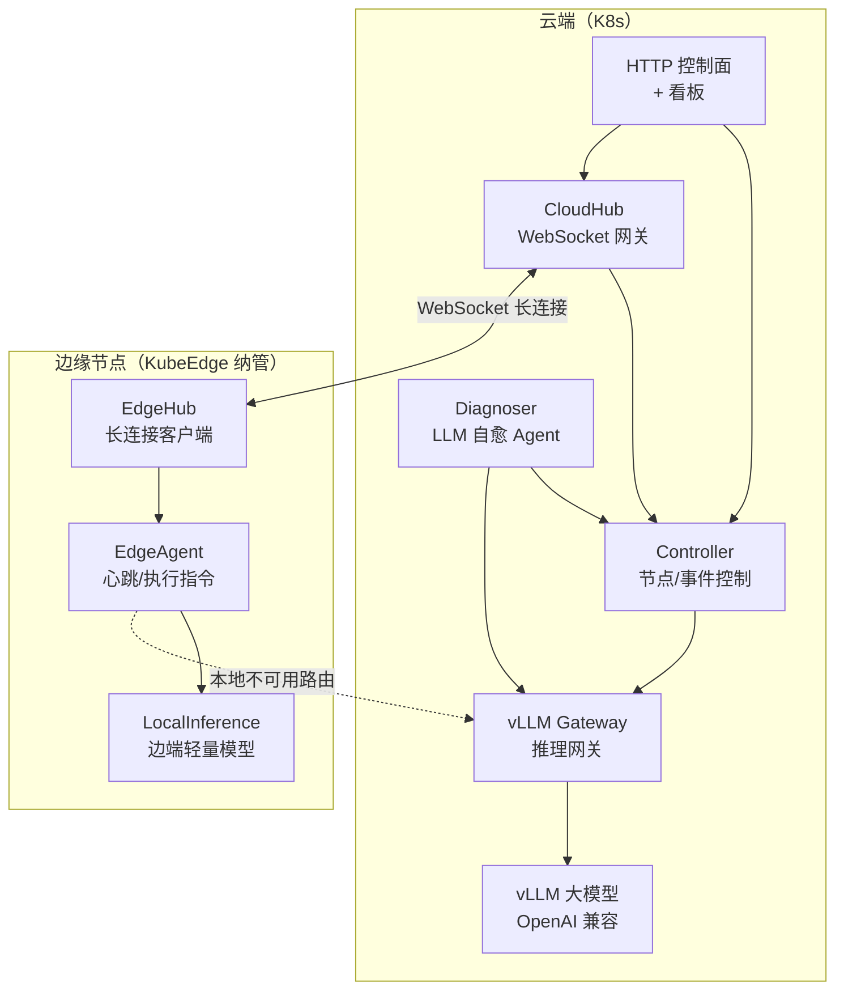
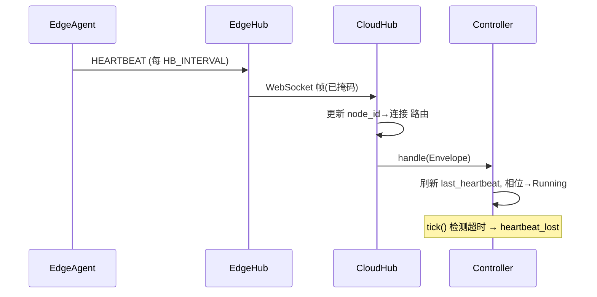
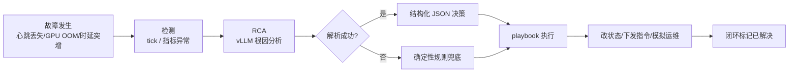

# EdgeMind 架构与云边通信机制详解

## 1. 组件全景

## 2. 云边通信机制（对齐 KubeEdge）

KubeEdge 的真实链路：`edgecore/edgehub` ⇄ `cloudcore/cloudhub`，基于 WebSocket，
消息以 `operation + resource` 路由到 `edgeController` / `deviceController`。

本项目同构实现：

| KubeEdge | EdgeMind | 说明 |
|---|---|---|
| `cloudcore.cloudhub` | `CloudHub`（`cloud/cloudhub.py`） | 云端 WebSocket 入口，维护 `node_id → 连接` 路由表 |
| `edgecore.edgehub` | `EdgeHub`（`edge/edgehub.py`） | 边端长连接客户端，自动重连 |
| `EdgeController` | `Controller`（`cloud/controller.py`） | 节点注册/心跳/指标/事件/指令 |
| `resource/message` | `Envelope`（`common/protocol.py`） | `{type, node_id, payload, seq, ts}` 统一信封 |
| 设备孪生 / 状态上报 | `METRICS` / `EVENT` / `HEARTBEAT` | 边端周期上报 |

### 帧层（自研 `common/ws.py`）

- RFC6455 握手：`Sec-WebSocket-Key` → `Sec-WebSocket-Accept`；
- 掩码：客户端→服务端必须 mask（本项目修复过「长度字节未置掩码位」的坑）；
- 长度：7 / 16 / 64 位扩展；
- 心跳：ping/pong；断线：指数退避重连。

## 3. 一条消息的旅程（以心跳为例）

## 4. 自愈闭环

## 5. 云边协同推理路由

| 条件 | 路由决策 | 执行方 |
|---|---|---|
| 本地模型已加载且健康 | 边端本地推理（低时延/离线） | `LocalInference` |
| 本地不可用 / 过载 | 路由到云端 vLLM | `EdgeAgent.infer` → 云端 `/v1/chat/completions` |
| 云端 vLLM 排队高 | 扩容副本 + 下沉部分请求到边端 | `scale_cloud_replicas` / `route_to_local_edge` |

## 6. 故障类型与处置对照

| 故障 | 检测来源 | RCA 根因 | 修复动作 |
|---|---|---|---|
| 心跳丢失 | `tick()` 超时 | 云边长连接中断 | mark_not_ready + reschedule_to_cloud + alert_oncall |
| GPU OOM | 边端 `EVENT` / 指标 | 显存不足，本地模型被杀 | fallback_edge_to_small_model + route_inference_to_cloud + restart_edge_runtime |
| 模型加载失败 | 边端 `EVENT` | 权重拉取/加载失败 | route_inference_to_cloud + restart_edge_runtime + alert_oncall |
| 时延突增 | 指标异常 | 云端排队 / 云边 RTT 高 | scale_cloud_replicas + route_to_local_edge + throttle_low_priority |
